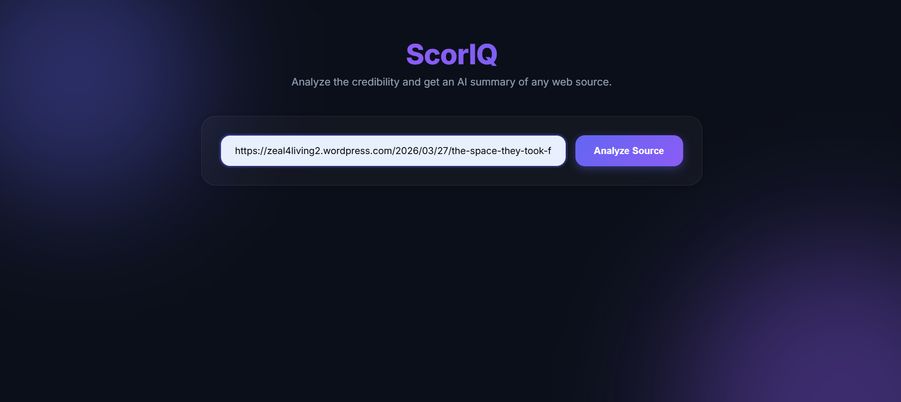
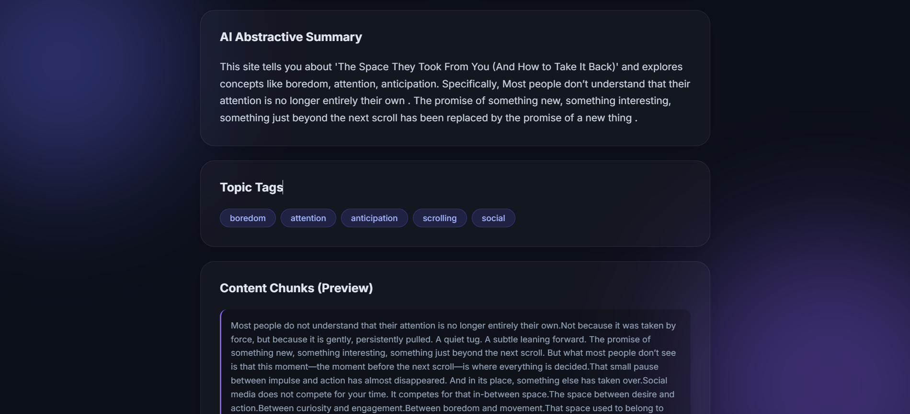
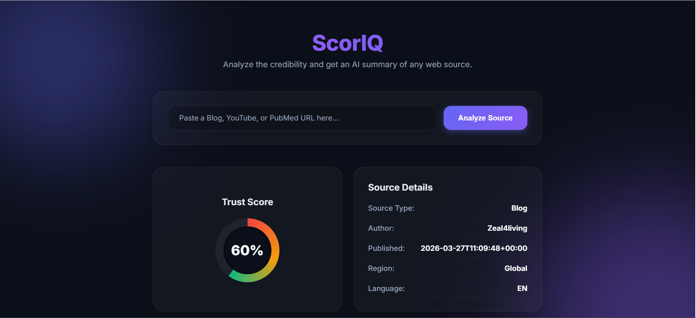

# Short Report: Web Scraping and Trust Scoring System

## 1. Scraping Strategy

The project adopts a multi-source, modular scraping strategy to handle the distinct architectural differences between unstructured web articles, video platforms, and scientific databases.

Instead of employing a single monolithic scraping logic, we utilize specific tools tailored to the medium:

* **Unstructured Blogs**: We deploy `BeautifulSoup4` alongside standard `requests`. Because blog structures vary wildly, the scraper looks for standard semantic HTML tags (`<meta name="author">`, `<article>`, `
`) to extract paragraphs and metadata.

* **YouTube**: Scraping YouTube HTML is notoriously brittle due to its heavy reliance on dynamic JavaScript and obfuscation. Therefore, the strategy utilizes `yt-dlp` to extract structured video metadata (view counts, upload dates) and the `youtube-transcript-api` to extract the actual spoken content of the video. This allows the NLP models to process the video's actual meaning rather than just its title.

* **PubMed**: Rather than parsing the HTML of the NCBI website, the strategy employs the official `Biopython` library to query the `Entrez` API. This ensures perfectly structured XML retrieval of academic abstracts, exact publication dates, and robust citation counts.

---

## 2. Topic Tagging Method

Topic tagging is handled via an automated, machine-learning approach rather than simple term frequency. The pipeline utilizes **KeyBERT**, a minimal and easy-to-use keyword extraction technique that leverages BERT embeddings.

The workflow is as follows:

1. The scraped text (whether a blog article, video transcript, or medical abstract) is passed into the `all-MiniLM-L6-v2` transformer model.
2. The model creates dense vector embeddings of the entire document.
3. It then embeds individual words and n-grams from the text.
4. Using cosine similarity, KeyBERT identifies the specific words that are most semantically similar to the overall meaning of the document.
5. The top 5 highest-scoring keywords are returned as the `topic_tags`.

This guarantees that the generated tags are contextually relevant to the entire article, rather than just frequently repeated stop-words.

---

## 3. Trust Score Algorithm

The Trust Score algorithm calculates a final credibility metric (0.0 to 1.0) by utilizing a sophisticated, multi-variable heuristic weighting system. The logic is based on 5 distinct parameters:

1. **Author Credibility (25%)**: Searches the author field for keywords denoting institutions (e.g., "university", "institute", "hospital"). Institutional authors receive a 0.9 multiplier, while anonymous authors receive a 0.3 penalty.

2. **Citation Count (20%)**: Directly correlates with PubMed citations. Papers with >100 citations receive a perfect 1.0, while articles with 0 citations receive a 0.4 (for non-medical sites, this serves as a baseline proxy).

3. **Domain Authority (20%)**: Evaluates the Top-Level Domain (TLD) of the source URL. Official `.gov` and `.edu` domains receive a 1.0 multiplier. Mainstream platforms like `youtube.com` receive a 0.7, while standard `.com` blogs are heavily penalized down to 0.5.

4. **Recency (20%)**: Information decays in reliability over time. Articles published within the current year receive a 1.0 multiplier. The score decays logarithmically, dropping to a severe 0.3 penalty for content older than 5 years.

5. **Medical Disclaimer Presence (15%)**: Evaluates the raw text for legal disclaimers (e.g., "consult a doctor", "not medical advice"). The presence of a disclaimer indicates responsible reporting, resulting in a 1.0 multiplier.

The formula guarantees that a highly cited, recently published government medical abstract will score perfectly, while a 5-year-old anonymous blog post will score extremely poorly.

---

## 4. Edge Case Handling

The system was engineered to gracefully manage several critical edge cases inherent in web scraping:

* **Missing Transcripts**: If a YouTube video does not contain closed captions, `youtube_transcript_api` will throw an exception. The system automatically catches this and falls back to passing the video's title and description into the NLP pipeline for summarization and tagging.

* **Hinglish / Foreign Language Subversion**: Standard language detectors often misclassify "Hinglish" (Hindi typed in English). We introduced a custom heuristic list of common Hinglish terms (e.g., "hai", "kya"). If detected, the system forces the language to `hi` (Hindi) and automatically defaults the region to `India`, overriding contradictory metadata.

* **Date Formatting Anomalies**: YouTube returns dates as `YYYYMMDD`, PubMed returns `YYYY`, and blogs return ISO 8601 strings. The processor utilizes a centralized `format_date` normalization function that gracefully parses any of these erratic formats into a unified, human-readable format via exhaustive `try-except` chains.

* **Empty Content**: If a scraped URL returns absolutely no text content, the system safely intercepts the `None` type, aborts the AI summarization to prevent pipeline crashes, and injects a `"Processing failed"` object into the dataset to alert the user without crashing the batch run.

---

## 5. Snippets From Dynamic Uploading

I extended the system with dynamic URL ingestion, enabling real-time scraping, processing, and transformer-based summarization for any input link.

   
  <em>Figure 1: Homepage UI</em>

   
  <em>Figure 2: Processing Pipeline Output</em>

   
  <em>Figure 3: Final Summarization & Scoring</em>

> Larger models like BART-large require significantly more RAM and longer load times, which can slow down the pipeline or even cause failures on standard systems. DistilBART avoids that while maintaining comparable output quality to an extent for the summary part. I aim to improve the summary component towards a more accurate and content-driven summarization of content from the link.

We can also further improve the system by converting this single-page web scraper into a multi-page web crawler for retrieving large amounts of data from product-based websites like Amazon, Zepto, etc. This would result in better scoring and summarization of a website.

We would need to ensure:

* Providing seed URLs
* A FIFO queue
* Scraper wrapped in a recursive function
* A “URL seen” hash table

---
